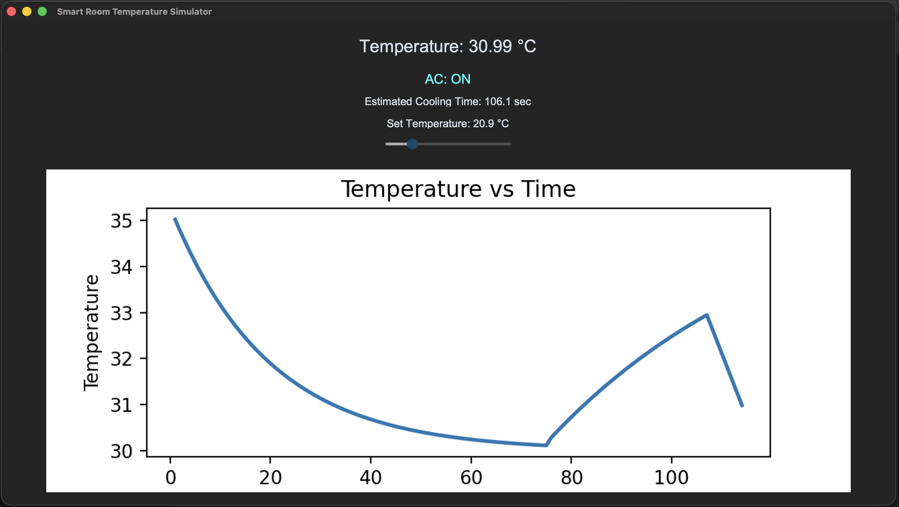

# Smart Room Temperature Simulator

## Overview

This project is a simple simulation of how an air conditioner regulates
room temperature using a thermostat-like control system. The program
models temperature changes over time and visualizes them in a graphical
interface.

It demonstrates basic concepts of: - Control systems (thermostat
logic) - Thermal behavior of a room - Real‑time simulation - Data
visualization with graphs

The goal of this project is educational: to experiment with how
temperature control systems behave rather than to model a perfectly
realistic HVAC system.

## Features

-   Adjustable **target temperature slider**
-   Automatic **AC ON/OFF control**
-   Simulated **room temperature physics**
-   **Cooling time estimation**
-   **Real‑time temperature graph**
-   Interactive **desktop GUI using CustomTkinter**

## Project Structure

    smart-room-temperature-simulator
    │
    ├── main.py
    ├── requirements.txt
    ├── README.md
    ├── .gitignore
    │
    ├── simulator
    │   ├── physics.py
    │   ├── controller.py
    │   └── predictor.py
    │
    └── ui
        └── dashboard.py

## Application Preview

  

## How It Works

### Temperature Physics

The simulation models how a room exchanges heat with the environment.

-   When AC is **OFF**, the room slowly moves toward the external
    temperature.
-   When AC is **ON**, the temperature decreases toward the set
    temperature.
-   Cooling speed is limited to imitate realistic AC behavior.

### Thermostat Control

A simple deadband thermostat controller is used:

-   AC turns **ON** when temperature rises above the target.
-   AC turns **OFF** when the target temperature is reached.

This prevents constant rapid switching.

### Cooling Prediction

The program estimates how long cooling might take using a simplified
exponential model.

The value is only an approximation intended for demonstration.

## Installation

Clone the repository:

    git clone https://github.com/yourusername/smart-room-temperature-simulator.git
    cd smart-room-temperature-simulator

Install dependencies:

    pip install -r requirements.txt

## Run the Program

    python main.py

## Limitations

This project is a simplified emulator and not a full physical model.
Some limitations include:

-   External temperature is fixed in the current version
-   No real hardware sensors
-   Cooling prediction is approximate
-   Simulation data is not saved between runs

## Possible Improvements

Future versions could include:

-   External temperature controls
-   Humidity simulation
-   Energy consumption estimation
-   Saving temperature history
-   Integration with real IoT temperature sensors

## Purpose of the Project

This project was created as a learning exercise while exploring Python
GUI development, simulation concepts, and modular program structure.

It is intended as a small engineering experiment rather than a
production system.
